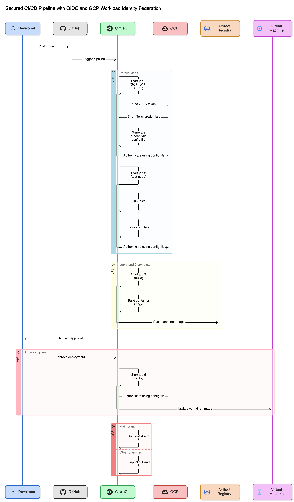

# Shopping-Cart-OIDC

#### Authentication Method: OIDC and Workload Identity Federation

This project uses *OpenID Connect (OIDC)* tokens and Google Cloud Platform's Workload Identity Federation for secure and streamlined authentication.

OIDC is an identity layer on top of OAuth 2.0 that allows clients to verify the identity of an end user based on the authentication performed by an authorization server. It provides a single sign-on (SSO) experience across applications.

*Workload Identity Federation* enables your workloads running on *CircleCI* to access *Google Cloud services* without needing long-lived service account keys. Instead, it uses short-lived, auto-rotated OIDC tokens, reducing the risk of credential leakage and enhancing security.

By leveraging these technologies, we eliminate the need for managing and securing service account keys, providing a more secure and efficient authentication process.

This shopping cart application is based on react js. The CICD pepeline is setup using circleci and containerised using Docker. 

## Available Scripts

In the project directory, you can run:

### `npm run start`

Runs the app in the development mode.\
Open [http://localhost:3000](http://localhost:3000) to view it in your browser.

The page will reload when you make changes.\
You may also see any lint errors in the console.

### `npm run test`

Launches the test runner in the interactive watch mode.\
See the section about [running tests](https://facebook.github.io/create-react-app/docs/running-tests) for more information.

### `npm run build`

Builds the app for production to the `build` folder.\
It correctly bundles React in production mode and optimizes the build for the best performance.

The build is minified and the filenames include the hashes.\
Your app is ready to be deployed!

See the section about [deployment](https://facebook.github.io/create-react-app/docs/deployment) for more information.

The primary purpose of this project
The CICD pipeline diagrammatic representation  --->

